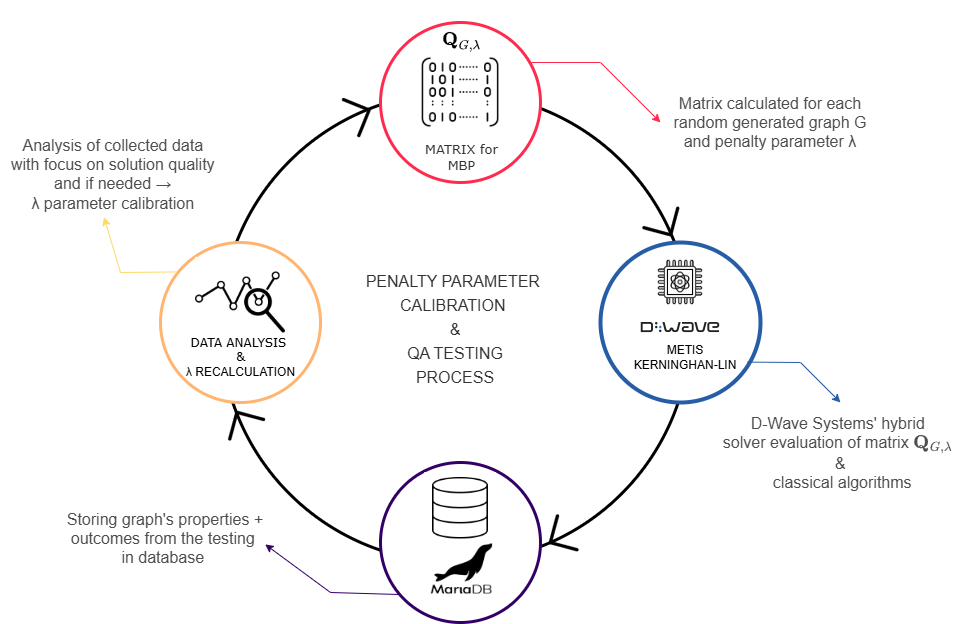

# Quantum Annealing for Minimum Bisection Problem: A Machine Learning-based Approach for Penalty Parameter Tuning
[[PAPER]]() 

The project QaMBP is the implementation of two experiments: <br>
I. QUBO penalty parameter tuning using GBR, <br>
II. Testing the solution quality of proposed QUBO formulation using D-Wave Systems' quatum annealing solvers.

## Abstract
Minimum Bisection Problem is a fundamental NP-hard problem in combinatorial optimization with applications in parallel computing, network design, and machine learning. This paper explores the feasibility and performance of using D-Wave Systems’ quantum annealing technology to solve the Minimum Bisection Problem, formulated as a Quadratic Unconstrained Binary Optimization model. A central challenge in such formulations is the selection of the penalty parameter, which significantly influences solution quality and constraint satisfaction.
To address this challenge, we propose a novel machine learning-based approach for adaptive penalty parameter tuning using Gradient Boosting Regressor model. The method predicts penalty values based on graph properties such as the number of nodes, and edge density, allowing for dynamic adjustment tailored to each instance of the problem. This enables hybrid quantum-classical solvers to more effectively balance the goal of minimizing cut size with maintaining equal partition sizes.
We evaluate the proposed method on a large dataset of randomly generated Erdős–Rényi graphs with up to 4000 nodes and compare the results with classical partitioning algorithms, Metis and Kernighan–Lin. Experimental findings demonstrate that our adaptive tuning strategy significantly improves the performance of hybrid quantum-classical solvers and consistently outperforms used classical methods, indicating its potential as an alternative for large-scale graph partitioning problem.


## 1. Penalty Parameter Calibration and QA Testing


Fig. 1. Proposed approach for penalty parameter tuning. Given graph <em><b>G(n,p)</b></em> prepare QUBO matrix <em><b>Q<sub>G,λ</sub></b></em> for MBP and given penalty parameter <em><b>λ</b></em>. Test the formulation using D-Wave QA HS, Metis and Kerninghan-lin algorithms, and store data in MariaDB. Analyse the results (solution feasibility and accuracy) and recalculate <em><b>λ</b></em> if necessary.

### 1.1. MBP QUBO Formulation and Matrix 
- in src mbp_qubo_matrix.py, 

### 1.2. QA Testing
- in src qa_testing.py

### 1.3. Benchmark algorithms
-in src pymetis,py, kerninghan_lin.py


## 2. QUBO penalty parameter tuning using GBR
- in src gbr_training.py (+ vystupy)

## 3. Graph generation
- in src graph_generation.py

## Setup
```
git clone https://github.com/rusnakrenata/qambp.git
cd src
pip install -r requirements.txt
```


main.py


