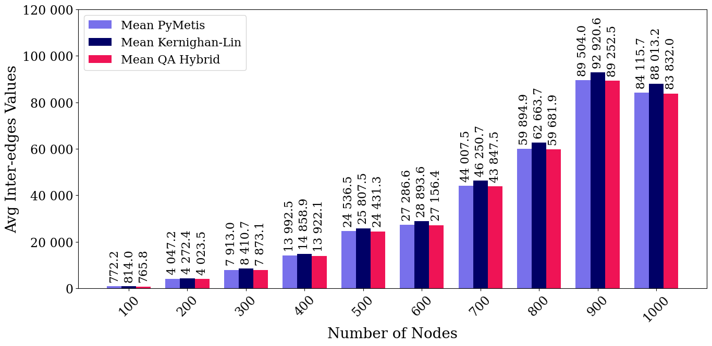
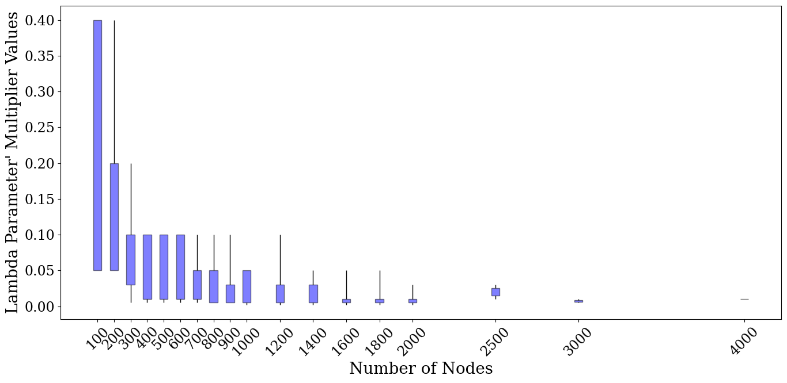
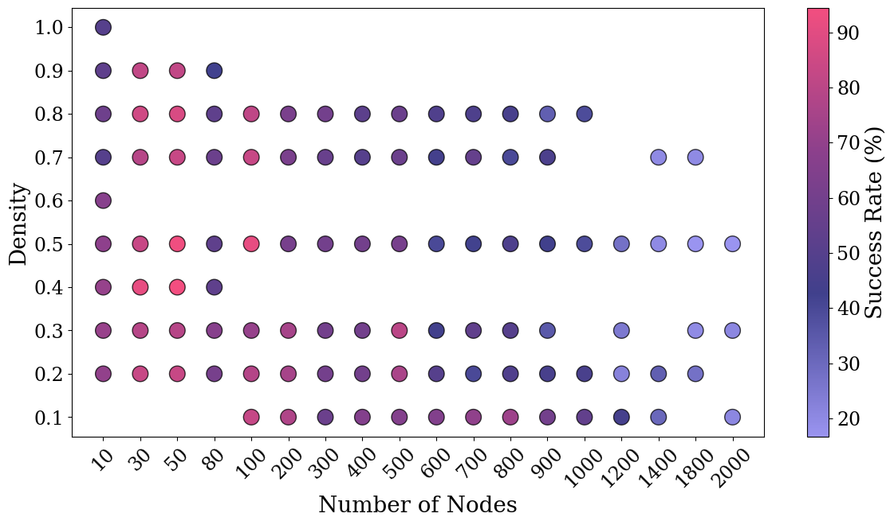
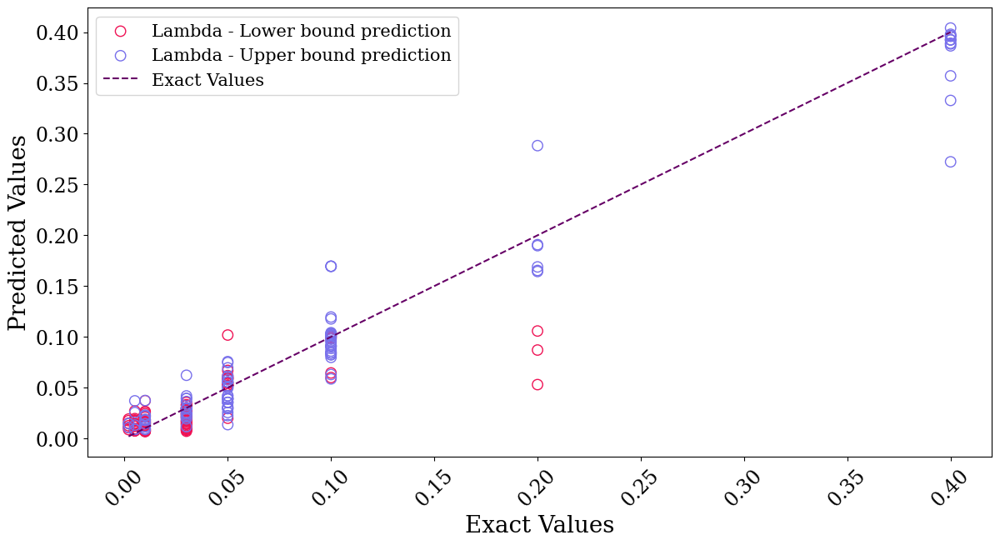
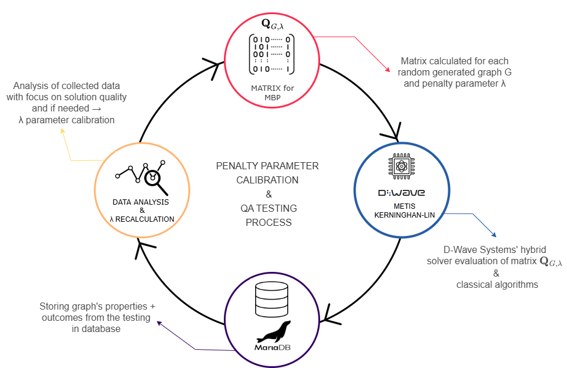
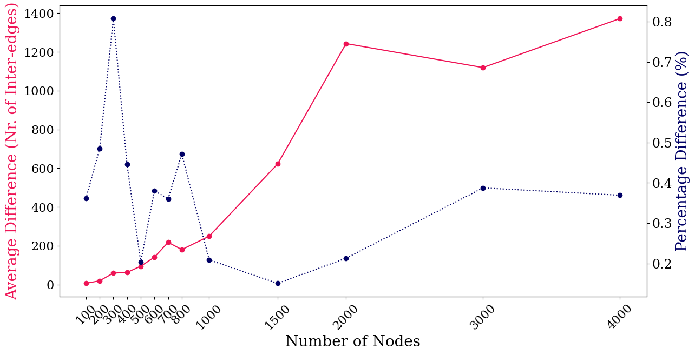
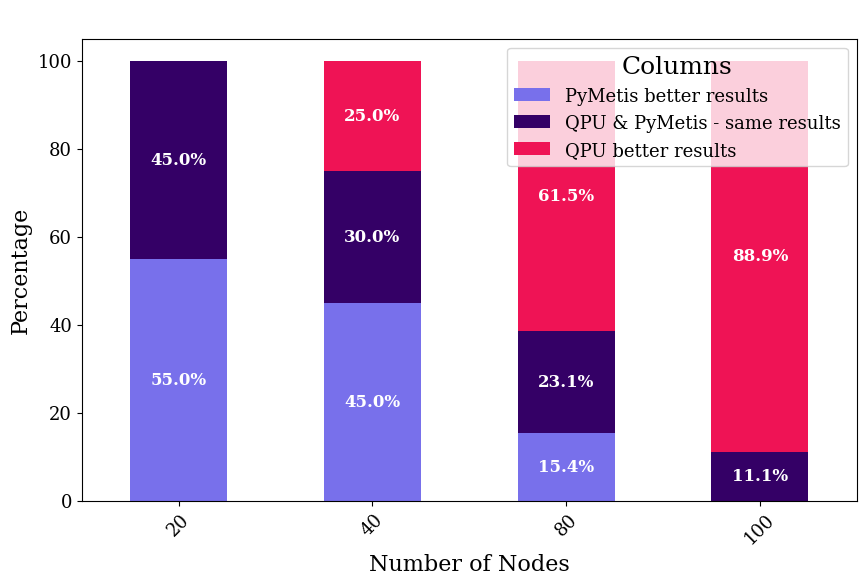

# Minimum Bisection Problem: Machine Learning–Based Penalty Parameter Tuning for Optimization on Quantum Annealers

[[PAPER]]() &nbsp;|&nbsp; [Setup](#setup) &nbsp;|&nbsp; [Reproducing the experiments](#reproducing-the-experiments) &nbsp;|&nbsp; [Method](#method) &nbsp;|&nbsp; [Results](#results)

**QaMBP** is the reference implementation for the paper above. It covers two stages:

1. **Calibration** — sweep candidate penalty multipliers on Erdős–Rényi graphs and record which ones yield the best balanced partitions.
2. **Prediction and evaluation** — train Gradient Boosting Regressors on that data to predict a penalty parameter for an unseen graph, then solve the QUBO with D-Wave's quantum annealing solvers.

## Abstract

The Minimum Bisection Problem is a fundamental non-deterministic polynomial-time hard problem with applications in parallel computing, network design, and large-scale data processing. When formulated as a Quadratic Unconstrained Binary Optimization problem for quantum annealing, solution quality depends critically on the choice of the penalty parameter that enforces balanced partitions. However, selecting this parameter is problem-dependent and typically relies on manual tuning or heuristics, limiting practical applicability in engineering settings.

This paper proposes a machine learning–based approach for automatic penalty parameter tuning. We employ a Gradient Boosting Regressor to predict suitable penalty values from structural graph features, specifically the number of nodes and graph density. The predicted parameter is then used to construct the model solved by D-Wave's quantum annealing solvers. The proposed method is evaluated on a large dataset of Erdős–Rényi graphs with up to 4000 nodes and compared against classical partitioning heuristics, including Metis and Kernighan–Lin algorithms. Experimental results show that the learned parameter selection significantly improves constraint satisfaction and cut minimization, enabling the hybrid quantum annealing solver to consistently outperform classical baselines.

**Keywords:** Combinatorial Optimization, Gradient Boosting Regressor, Machine Learning, Minimum Bisection Problem, Penalty Parameter Tuning, Quantum Annealing

---

## Setup

Requires Python 3.10+, a MariaDB/MySQL database, and a D-Wave Leap account.

```bash
git clone https://github.com/rusnakrenata/qambp.git
cd qambp

python -m venv .venv
# Windows
.venv\Scripts\activate
# Linux / macOS
source .venv/bin/activate

pip install -r requirements.txt
```

### Configuration

Credentials are read from the environment; nothing is hardcoded. Copy the template and fill it in:

```bash
cp .env.example .env
```

```ini
DB_USER=your_db_user
DB_PASSWORD=your_db_password
DB_HOST=localhost
DB_PORT=3306
DB_NAME=graphPartitioning

DWAVE_API_TOKEN=your_leap_api_token
# or, instead of a token, name a profile from ~/.config/dwave/dwave.conf
# DWAVE_PROFILE=defaults
```

For D-Wave you may either set `DWAVE_API_TOKEN` or run `dwave config create` and point `DWAVE_PROFILE` at the resulting profile.

Create an empty database once; the tables are created automatically on first run:

```sql
CREATE DATABASE graphPartitioning;
```

`DATABASE_URL` overrides the individual `DB_*` settings if you need a different backend (the test suite uses `sqlite://`).

### Verifying the install

```bash
python -m pytest tests/ -v
```

The tests stub the Ocean SDK and use an in-memory database, so they run without Leap credentials or a live server.

---

## Reproducing the experiments

The pipeline runs in three steps. Steps 1 and 3 consume D-Wave Leap solver time.

```bash
cd src

# 1. Calibration: sweep the lambda_mult grid (Table 3) and record results
python main.py --mode hybrid --scope 607
python main.py --mode qpu    --scope 70     # optional, n <= 100

# 2. Train the regressors on the collected data
python gbr_prediction.py --train

# 3. Evaluation: predict lambda per graph and solve once (Algorithm 3)
python predict_and_evaluate.py --mode hybrid --scope 126
python predict_and_evaluate.py --mode qpu    --scope 70
```

Both entry points accept `--seed` for reproducible graph selection. Results land in the `graphs` and `partitions` tables and are analysed with the queries in [`sql/`](sql/) and the notebook [`src/analysis.ipynb`](src/analysis.ipynb).

Trained models are shipped in `src/gbr/`, so step 3 can be run without repeating steps 1–2.

---

## Method

### 1. QUBO formulation

For a graph *G(V, E)* with binary variables *x<sub>i</sub>* indicating partition membership, the objective combines the cut size with a quadratic balance penalty:

%20=%20\sum_{(i,j)%20\in%20E}%20(x_i%20+%20x_j%20-%202x_ix_j)%20+%20\lambda%20\left(%20\sum_{i%20\in%20V}%20x_i%20-%20\frac{n}{2}%20\right)^2)

The penalty parameter λ shifts every linear coefficient by λ(1 − n), adds a uniform 2λ to all pairwise interactions, and introduces a constant offset that does not affect the argmin.

**Constructing the matrix Q<sub>G,λ</sub>** (`src/qubo_matrix.py`):

```
1. Initialize Q_{G,λ} as an empty matrix

2. Add coefficients from E_cut(x):
   For each edge (i, j) in E:
       Q[i, i] ← Q[i, i] + 1
       Q[j, j] ← Q[j, j] + 1
       Q[i, j] ← Q[i, j] - 2

3. Add coefficients from E_balance(x):
   For each node i in V:
       Q[i, i] ← Q[i, i] + λ(1 - n)
   For each pair (i, j), i ≠ j:
       Q[i, j] ← Q[i, j] + 2λ
```

Because the balance term couples every pair of vertices, the resulting model has **O(n²)** quadratic coefficients regardless of how sparse *G* is. This dominates memory use and construction time at large *n*.

### 2. Bounding the penalty parameter

Analysing the worst case for an unbalanced solution gives a lower bound of λ ≥ 1. Requiring that moving a single node out of a balanced partition never reduces the energy gives an upper bound, yielding:

),%20\frac{n}{2}%20-%201\right))

The midpoint of this interval is used as the initial graph-dependent estimate:

),%20\frac{n}{2}%20-%201)}{2})

### 3. Empirical multiplier grid

Testing showed λ<sub>est</sub> alone over-weights the balance term on larger graphs, so it is scaled by a multiplier: **λ = λ<sub>est</sub> · λ<sub>mult</sub>**. Larger graphs need smaller multipliers, because the balance penalty grows quadratically in *n* while the cut term grows roughly linearly. The candidate grids (encoded as `LAMBDA_MULT_GRID` in `src/main.py`):

| Number of nodes (n) | Candidate λ<sub>mult</sub> values |
|---|---|
| 100, 200 | 0.05, 0.1, 0.2, 0.4 |
| 300, 400, 500 | 0.005, 0.01, 0.03, 0.05, 0.1, 0.2 |
| 600, 700, 800, 900 | 0.005, 0.01, 0.03, 0.05, 0.1 |
| 1000, 1500, 2000 | 0.002, 0.005, 0.01, 0.03, 0.05, 0.1 |
| 2500, 3000, 4000 | 0.0005, 0.001, 0.002, 0.005, 0.01, 0.03, 0.05, 0.1 |



*Cut edges from Kernighan–Lin, PyMetis and QA HS across the candidate multipliers.*

For each graph, the multipliers achieving the minimum cut define an interval [λ<sub>min</sub>, λ<sub>max</sub>] — the regression targets.



*Ranges of effective λ<sub>mult</sub> by graph size across 607 calibration graphs.*



*Success rate as a function of the selected multiplier. Mid-range densities (0.25–0.75) are easiest; very sparse and very dense graphs are harder.*

### 4. Learning the multiplier range

Two Gradient Boosting Regressors predict the interval endpoints from three features.

```
Training (src/gbr_prediction.py --train)
  1. Extract graph properties (n, |E|) and targets (λ_min, λ_max) from the database
  2. Compute features: n, ρ = 2|E| / [n(n-1)], λ_est
  3. Fit gbr_min and gbr_max
  4. Evaluate with RMSE, MAE, R²
  5. Pickle both models to src/gbr/

Prediction (Algorithm 3)
  1. λ_est = (1 + min(n/2 - 1, max(deg(G)))) / 2
  2. f = (n, ρ, λ_est)
  3. (λ_min, λ_max) = gbr_min(f), gbr_max(f)
  4. λ = λ_est · (λ_min + λ_max) / 2
```

Graph density ρ is used rather than the generator parameter *p*, so the model depends only on properties measurable on any input graph, not on how it was produced.

**Configuration** — scikit-learn 1.6.1, defaults retained (`n_estimators=100`, `learning_rate=0.1`, `max_depth=3`, `loss='squared_error'`), `random_state=42`, early stopping disabled. No hyperparameter search, no feature scaling. 607 instances split 80:20 into 485 training and 122 test.



| Target | R² | RMSE | MAE |
|---|---|---|---|
| λ<sub>max</sub> | 0.9028 | 0.0360 | 0.0188 |
| λ<sub>min</sub> | 0.4489 | 0.0211 | 0.0124 |

The weaker R² for λ<sub>min</sub> reflects its narrow empirical spread — R² is sensitive to target variance — and should be read alongside its small absolute errors.

---

## Experimental setup

**Graphs.** Erdős–Rényi *G(n, p)*, chosen because size and expected density can be varied systematically.

- *n* ∈ {100, 200, 300, 400, 500, 600, 700, 800, 900, 1000, 1500, 2000, 2500, 3000, 4000}
- *p* ∈ {0.1, 0.25, 0.5, 0.75}
- 607 calibration graphs, 126 independent evaluation graphs, 70 QPU graphs (n ≤ 100)

**Solvers.** D-Wave Leap `LeapHybridSampler` for the hybrid experiments; `EmbeddingComposite(DWaveSampler())` on an Advantage QPU (Pegasus, 5640 qubits) for direct execution, using minorminer embedding, default chain strength, 20 µs annealing time and 10 reads. Baselines are PyMetis and an in-house Kernighan–Lin implementation modified to start from two equally sized sets, so that it is held to the same balance requirement as QA HS.

**Hardware.** Classical work ran on a Linux VPS — Intel Core (Haswell), 3 cores at 2.6 GHz, 6 GB RAM, Ubuntu Server 24 LTS. Quantum resources were used only to solve the QUBO instances.



*Overall workflow: build Q<sub>G,λ</sub>, solve with QA HS / Metis / Kernighan–Lin, store in MariaDB, analyse, and refine λ.*

---

## Results

### Hybrid solver

Across 126 evaluation graphs with the GBR-predicted penalty, QA HS returned a valid balanced partition in **100%** of cases and a strictly smaller cut than PyMetis in **100%** of cases. PyMetis produced a balanced partition in approximately 50% (Metis does not enforce the balance constraint).

A two-sided Wilcoxon signed-rank test on the paired cut differences gave W = 0 with p < 0.001; all 126 paired differences favoured QA HS.



*Absolute and percentage differences in cut edges, QA HS vs PyMetis.* The absolute gap grows with *n*, reaching 1372 cut edges at n = 4000, while the percentage difference stabilises around 0.30–0.40% for larger graphs.

### Effect of the tuning strategy

| Strategy for setting λ | Solution found [%] | Hybrid better [%] |
|---|---|---|
| λ = max<sub>cut</sub>(p) | 77.93 | 72.71 |
| λ = λ<sub>est</sub> | 92.03 | 90.20 |
| λ = λ<sub>est</sub> · λ<sub>mult</sub> | 100.00 | 98.53 |
| **λ predicted via GBR** | **100.00** | **100.00** |

### Direct QPU



On 70 graphs with n ≤ 100, PyMetis consistently wins for small graphs (20–40 nodes), while the QPU more often produces fewer cut edges at 60–100 nodes, reaching an 88.9% success rate at n = 100. The crossover sits near 80 nodes. Part of the weakness at small *n* is that the models were trained mainly on graphs with n ≥ 100.

### Runtime

PyMetis was on average about three times faster than the total QA HS time for n ≥ 1000, and faster still on smaller graphs. QA HS timing includes BQM construction, cloud latency, preprocessing, hybrid execution and post-processing. QUBO matrix construction was not optimised and reached 163 seconds at n = 4000.

---

## Project structure

| Path | Purpose |
|---|---|
| `src/main.py` | Calibration sweep over the λ<sub>mult</sub> grid. `--mode {hybrid,qpu}` |
| `src/predict_and_evaluate.py` | Evaluation stage — Algorithm 3, one solve per graph |
| `src/gbr_prediction.py` | Trains and applies the two regressors. `--train` to retrain |
| `src/gbr/` | Pickled `gbr_min.pkl` and `gbr_max.pkl` |
| `src/qubo_matrix.py` | Builds Q<sub>G,λ</sub> from the graph and penalty parameter |
| `src/qa_testing.py` | Runs the QUBO on a D-Wave sampler and selects the best balanced sample |
| `src/graph_generation.py` | Erdős–Rényi generation plus density, clustering, λ<sub>est</sub> |
| `src/pymetis_testing.py` | PyMetis baseline |
| `src/kerninghan_lin.py` | Balanced Kernighan–Lin implementation |
| `src/kerninghan_lin_testing.py` | Kernighan–Lin timing and result formatting |
| `src/database_tables.py` | SQLAlchemy models, connection, experiment tags |
| `src/store_into_db.py` | Persists graphs and partition results |
| `src/analysis.ipynb` | Figures and analysis |
| `sql/` | Analysis queries backing the tables and figures |
| `tests/` | Regression tests for sample selection, schema and prediction |

### Database

Two tables. `graphs` holds one row per generated instance with its structural properties and both classical baselines; `partitions` holds one row per solver run, keyed by `graph_id`.

Runs are tagged via `graphs.description`, which the queries in `sql/` filter on:

| Constant | Value | Meaning |
|---|---|---|
| `DESCRIPTION_CALIBRATION` | `No description` | λ<sub>mult</sub> sweep, hybrid solver |
| `DESCRIPTION_EVALUATION` | `regression_KLPM` | GBR-predicted λ, hybrid solver |
| `DESCRIPTION_QPU` | `qpu` | Direct-QPU runs |

`No description` is a historical default retained so that newly generated rows remain comparable with the published dataset.

Infeasible runs — where the solver returned no balanced sample — are recorded with `qa_inter_edges = 1000000`; the analysis queries filter these with `qa_inter_edges < 1000000`.

---

## Limitations

- Both datasets consist exclusively of Erdős–Rényi graphs. The trained models should **not** be assumed to transfer to road networks, social networks, VLSI circuits or other structured graphs without recalibration.
- The balance penalty makes the BQM dense — O(n²) quadratic terms — which bounds practical problem size. Experiments stop at 4000 vertices.
- Baselines are Metis and Kernighan–Lin. General-purpose QUBO solvers (simulated annealing, tabu search, Gurobi) were not included in the independent evaluation.
- The workflow depends on D-Wave's proprietary cloud platform; solver internals, availability and cost are outside the user's control.
- Only static bipartitioning is addressed. Extension to *k*-partitioning would require a new formulation and fresh calibration.

## Citation

```bibtex
@article{qambp,
  title  = {Minimum Bisection Problem: Machine Learning--Based Penalty Parameter
            Tuning for Optimization on Quantum Annealers},
  journal = {Engineering Applications of Artificial Intelligence},
  year   = {2026}
}
```

## License

MIT — see [LICENSE](LICENSE).
